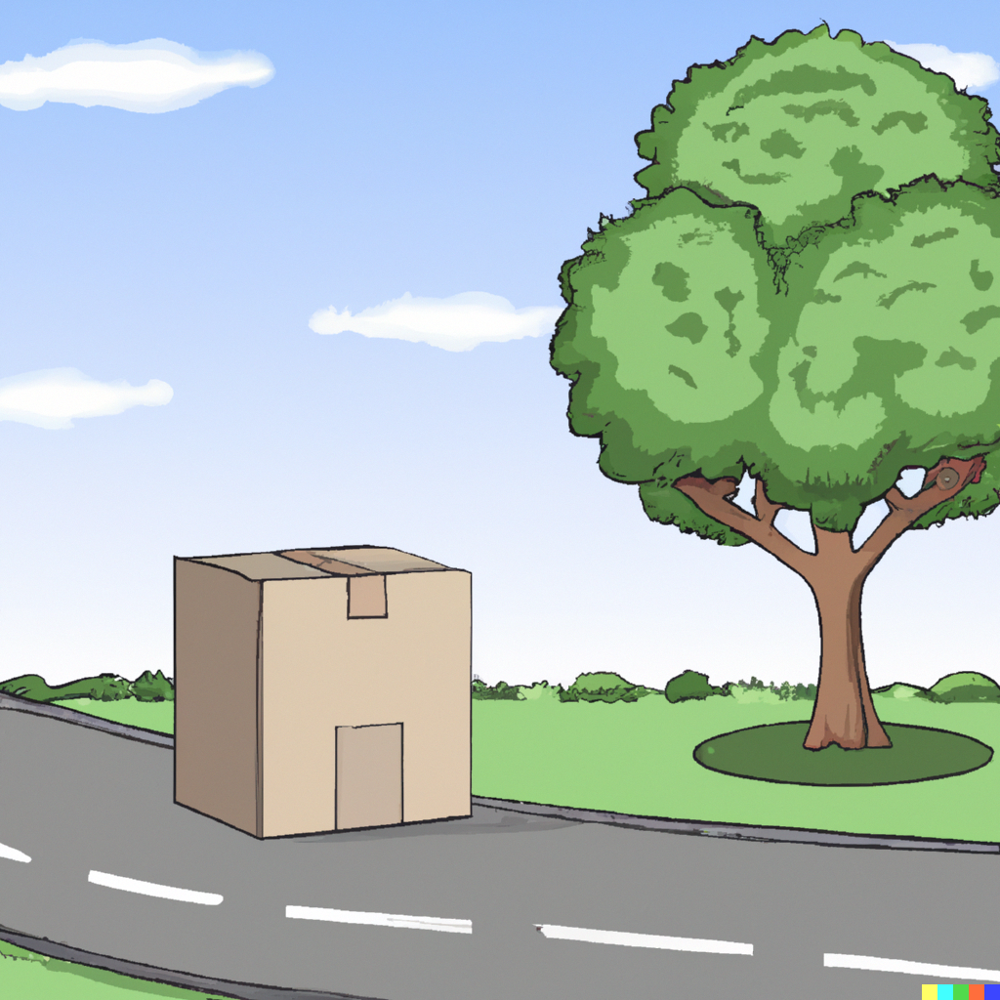
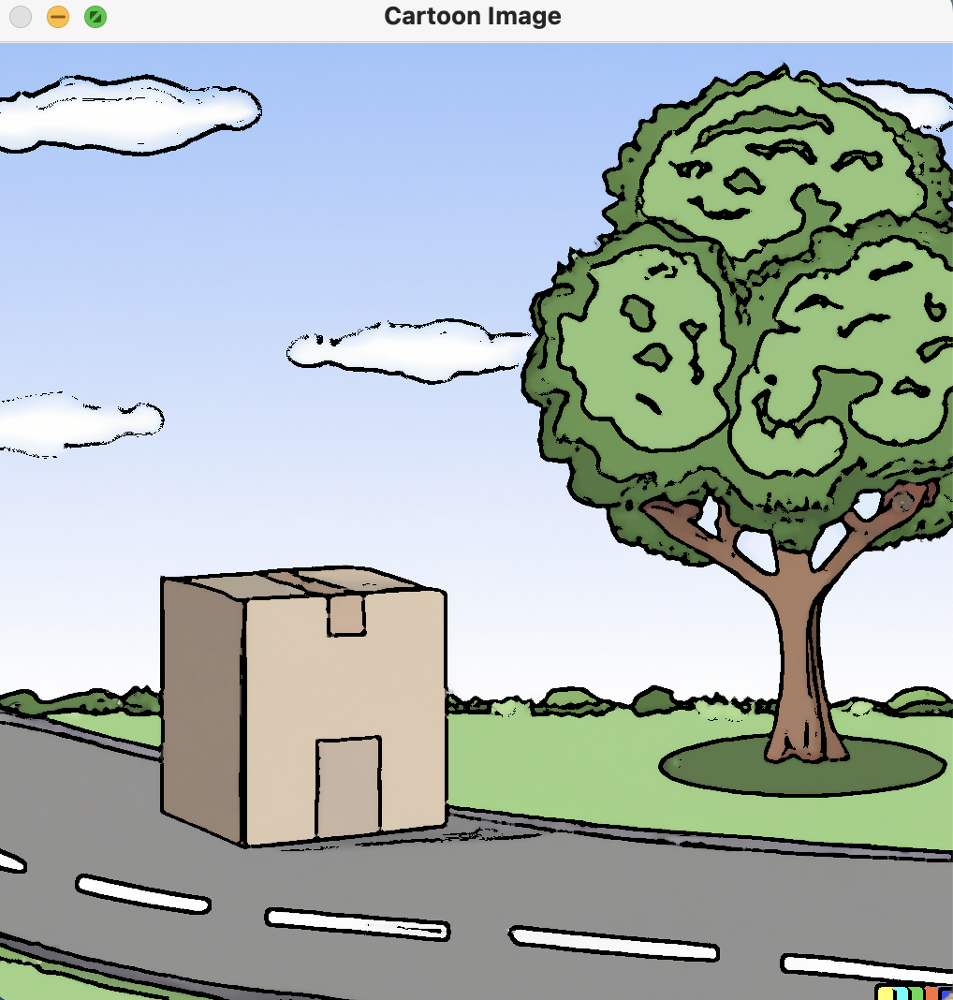

# Cartoonisation in Neuroprosthesis: Exploring Cartoonisation to reduce neuro over-stimulation 

----

Source code for a Cartoonisation technique that makes use of the Opencv library. Cartoonisation is very important in image processing, especially in neuroprosthesis, as it is important to avoid over-stimulation so that the brain can process the data. 

### Cartoonisation: 

Cartoonisation is a process that transforms regular images into stylized, simplified versions that resemble cartoon drawings. This is important in neuroprosthesis as there is a trade-off for importance, meaning that certain objects must be detected and others can be disregarded. Cartoonisation, when applied to visual prosthetics (neuroprostheses for vision), can be beneficial due to several reasons related to the way it simplifies visual data and the unique requirements of these devices, as explored below: 

### Why Cartoonisation? 

+ Avoid Overstimulation: Overloading the brain with too much information, especially when it's not used to processing visual data, can be overwhelming or even counterproductive. Cartoonised images can help avoid this problem by delivering only the most essential visual data.
+ Energy Efficient: Transmitting simplified visual data could reduce the power consumption of implantable devices, which is a significant focus point for neuroprostheses.
+ Enhance Contrast: Cartoonised images emphasise edges and contrast, which is useful in visual prosthetics. Higher contrast can make objects and people stand out more clearly against backgrounds, aiding in navigation and object recognition.

### Pre-Cartoonisation: 

### Post-Cartoonisation:
